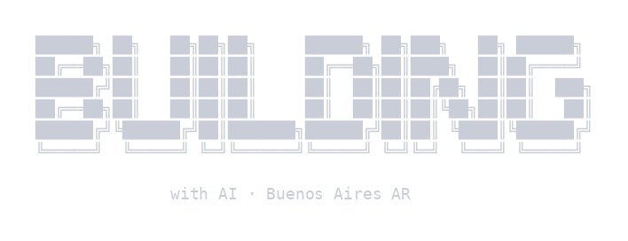

<div align="center">
  
</div>

---

# IT Professional combining development, operations management, and product vision.

- Lately, my main focus is on one thing: **Exploring, building, and developing with Artificial Intelligence.**

- I combine technical depth with product thinking to ship end-to-end solutions: from automations to conversational agents, generative AI pipelines, and tools that solve real problems.

---

## 🔭 What I'm working on right now

Currently dedicating my time to independent **AI Tooling & Integrations** projects, pushing the boundaries of what can be built with today's AI tools:

- 🤖 **End-to-end AI bots & agents** with Claude Code and Cowork, integrating REST APIs, WebSockets, and RSS
- 🔀 **LLM routing** (Ollama, NIM) for multi-agent environments with bidirectional communication via Slack + n8n
- 🖐️ **Real-time gesture control** for Windows — Python + MediaPipe + Win32 API, with FSM, debounce, and EMA smoothing
- 🎨 **Generative AI pipelines** in ComfyUI — image and video generation, LoRA training, Flux, Wan 2.2, Qwen
- 🗄️ **Conversational database analysis** via MCP/DBHub

---

## 🧰 Stack & Tools

```yaml
AI & Automation:
  - Claude Code · Cursor · VS Code
  - Ollama · LLM Prompt Engineering
  - ComfyUI · n8n · Custom Agents

Languages & Web Integrations:
  - Python · SQL · JavaScript · HTML/CSS · Bash · PowerShell
  - REST APIs · WebSockets · RSS · Webhooks

Infra & Data:
  - MCP · Docker · Cloudflare Dashboard · SSH · AWS EC2 · Google VM Instances
  - Metabase · Power BI · Retool

Ops & Product:
  - ServiceNow · Intercom · Jira · Slack
  - ITIL · SLA Management · QA & Testing
```

---

## 🧭 Background

My path blends disciplines, giving me a perspective that spans from technical detail to business vision:

| Role | Company | Period |
|---|---|---|
| AI Tooling & Integrations | Independent Project | Nov 2025 – Present |
| Back Office Lead & Product Contributor | DolarApp (Fintech / ARQ) | Apr – Nov 2025 |
| IT Operations Analyst | Accenture | Dec 2021 – May 2024 |

🎓 Bachelor's in **Multimedia & Interaction Design** - UADE (UX/UI, emerging interactive technologies)

---

## 💬 A bit more

- 📍 Buenos Aires, Argentina
- 🌐 Native Spanish · Advanced English
- 🧠 I like going deep into the technical details of a problem before jumping to solutions
- 🔧 If there's an AI tool for something, I'm going to try it
- ⚡ I believe the most interesting moment to build with AI is **right now**

---

<div align="center">

*"I'm not just interested in using AI. I'm interested in understanding how it works and building with it."*

</div>
